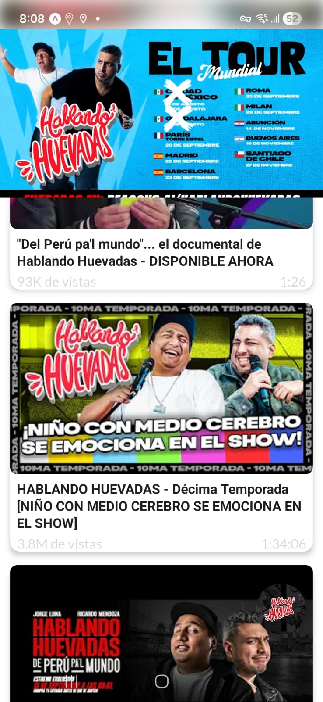
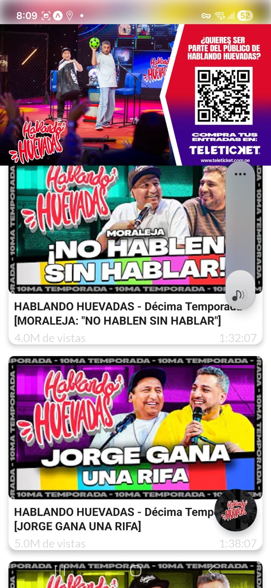
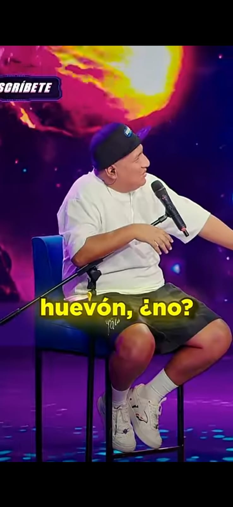
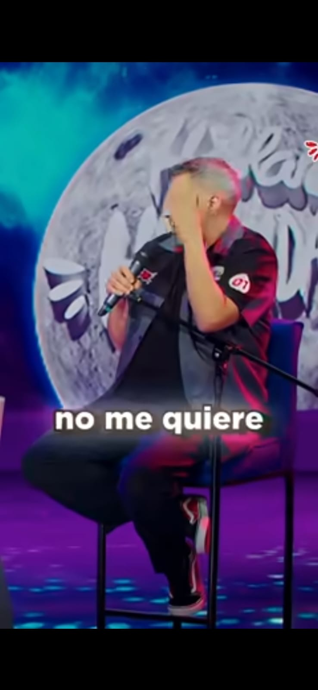

# 🎤 Hablando Huevadas - ¡Del Perú para el mundo! 🌎

¡Hola! 👋 Bienvenidos al repositorio oficial de **Hablando Huevadas**. Aquí encontrarás todo lo relacionado con nuestro contenido, desde el desarrollo de nuestra plataforma hasta los recursos que usamos para llevar nuestras locuras a cada rincón del planeta. 🌟

## 📽️ Nuestro Documental
🎬 "Del Perú pa'l mundo"... el documental de **Hablando Huevadas** ya está disponible. ¡No te lo pierdas! Es un viaje lleno de risas, emociones y mucho más. 😄

## 🌍 El Tour Mundial
🚀 Estamos llevando nuestras ocurrencias a nivel internacional. Aquí están las fechas y lugares:

- 🇲🇽 **Ciudad de México**
- 🇲🇽 **Guadalajara**
- 🇫🇷 **París** - Torre Eiffel
- 🇪🇸 **Madrid**
- 🇪🇸 **Barcelona**
- 🇮🇹 **Roma**
- 🇮🇹 **Milán**
- 🇵🇾 **Asunción**
- 🇦🇷 **Buenos Aires**
- 🇨🇱 **Santiago de Chile**

¡Gracias por acompañarnos en esta aventura! 🎉

## 🎙️ Décima Temporada
🎭 **Hablando Huevadas** está en su décima temporada, y cada episodio es una montaña rusa de emociones. Desde "Niño con medio cerebro se emociona en el show" hasta "Jorge gana una rifa", ¡no paramos de sorprender! 🤯

## 🎟️ ¿Quieres ser parte del público?
¡Únete a nosotros en vivo! Compra tus entradas en [Teleticket](https://www.teleticket.com.pe) y sé parte de la diversión. 🎟️

## 📢 Síguenos
🔔 Suscríbete a nuestro canal y no te pierdas ningún episodio. ¡Estamos aquí para hacerte reír! 😂

## 👨‍💻 Sobre el Autor

¡Hola! Soy **Binni Cordova**, un desarrollador apasionado y fan de **Hablando Huevadas**. Este proyecto nació de mi admiración por el programa y mi deseo de contribuir a su comunidad. 🌟

### 🌐 Mi Portafolio y Apoyo
- 🌍 [Mi Portafolio](https://binnicordova.dev)
- ☕ [Buy Me a Coffee](https://buymeacoffee.com/binnicordova)
- 💳 [PayPal](https://paypal.me/binnicordova)

Si quieres apoyar mi trabajo y ayudarme a seguir añadiendo características a esta aplicación, ¡tu contribución será muy apreciada! 💌

---

## 🚀 Características Actuales

- [x] 🎥 **Reproductor de Videos**: 535 episodios completos y +3,000 shorts.
- [x] 🎯 **Huevada del día**: un clip elegido cada 24 horas, igual para toda la comunidad.
- [x] 🔎 **Búsqueda**: busca entre todo el catálogo por título o invitado, sin acentos ni mayúsculas.
- [x] 🗂️ **Favoritos**: guarda cualquier clip con un toque.
- [x] ⏯️ **Seguir viendo**: retoma cada episodio donde lo dejaste.
- [x] 🔥 **Racha diaria**: mantén tu racha viendo un clip al día.
- [x] 🔗 **Compartir Videos**: comparte a WhatsApp, TikTok o Instagram en un toque.
- [x] 🔔 **Notificaciones inteligentes**: varias al día, elegidas según lo que ves, en tus horas; bajan solas si las ignoras.
- [x] ⚡ **Autoplay en Shorts**: cada short arranca al deslizar y salta al siguiente cuando termina.
- [x] 🏷️ **Títulos limpios y temporadas**: el catálogo se lee por episodio, no por el título gritado de YouTube.
- [x] 🌗 **Modo oscuro**: sigue el ajuste del sistema.
- [x] 📴 **Catálogo offline**: explora, busca y organiza sin conexión.
- [x] 🌐 **Multiplataforma**: Android y iPhone, compatible con Expo Go.

## 🌟 Posibles Características Futuras

- [ ] 📅 **Calendario de Eventos**: consulta las fechas y lugares del tour mundial.
- [ ] 🎬 **Clips descargables para redes**: exporta un clip vertical con marca de agua.
- [ ] 🗨️ **Chat Comunitario**: conéctate con otros fans de Hablando Huevadas.
- [ ] 💬 **Comentarios por Segundo**: comentarios sincronizados con momentos del video.

📊 Auditoría de producto y crecimiento: [`docs/product-audit.md`](docs/product-audit.md) · ASO/CRO: [`docs/aso-cro.md`](docs/aso-cro.md)

¡Tu apoyo y sugerencias son bienvenidos para seguir mejorando esta aplicación! 💡

---

💻 **Este repositorio** contiene:
- Código fuente de nuestra plataforma.
- Recursos multimedia.
- Scripts para automatización.

Si tienes alguna pregunta o sugerencia, ¡no dudes en contactarnos! 💌

---

🌟 **Gracias por ser parte de esta comunidad increíble.** ¡Nos vemos en el próximo show! 🎉

